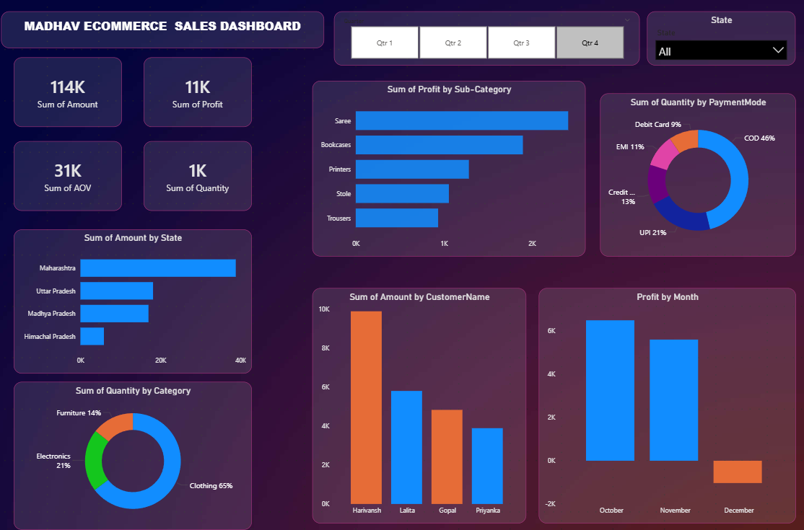

# E-Commerce Sales Analysis Dashboard 

##  Project Overview
This project features a professional **Power BI Dashboard** developed to analyze e-commerce sales performance. It transforms raw transactional data into high-level business insights, focusing on sales efficiency, order volume, and profitability.

##  Key Features
* **Dynamic Calculations:** Utilized DAX to calculate critical metrics like **Sum of Sales** and **Average Order Value (AOV)**.
* **Interactive UI/UX:** Designed a **3D-layered professional layout** with a minimal gradient aesthetic for clear data storytelling.
* **Dynamic Filtering:** Includes interactive slicers for Categories, Regions, and Time periods to allow for real-time data exploration.
* **Data Transformation:** Performed ETL (Extract, Transform, Load) using **Power Query** to clean and prepare data for modeling.

##  Dashboard Preview

*A professional, minimal, and interactive 3D layout for executive reporting.*

##  Technical Stack
* **Tool:** Microsoft Power BI Desktop
* **Data Source:** CSV / Excel
* **Techniques:** Power Query, DAX, Data Modeling, UI/UX Design

##  Project Structure
* **[Dashboard File](https://github.com/surajyadav011/E-Commerce-Sales-Analysis-Dashboard-in-power-bi/tree/main/dashboard%20file):** Contains the `.pbix` file.
* **[Data](https://github.com/surajyadav011/E-Commerce-Sales-Analysis-Dashboard-in-power-bi/tree/main/data):** Contains the raw `Orders.csv` used for analysis.

##  How to Use
1. Clone the repository or download the files.
2. Open the `.pbix` file in **Power BI Desktop**.
3. If prompted, refresh the data source to link the `Orders.csv` from the data folder.
4. Interact with the slicers to explore different sales trends.

---
*Developed as a professional portfolio project to demonstrate Business Intelligence and Data Visualization skills.*
---
##  Author
* **Suraj Yadav** - [GitHub Profile](https://github.com/surajyadav011)
